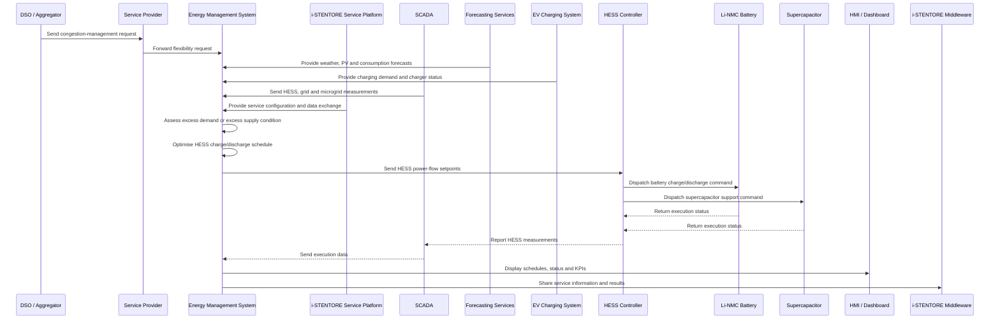

# Implementation Details of Congestion Management in Demo 4

## Demo Context

Demo 4 corresponds to the i-STENTORE demonstrator **Cooperative Modular Multi Hybrid Energy Storage Systems based on Hybrid SuperCap / Li-NMC batteries for Smart DC Microgrids of E-mobility Service – Italy**.

The demonstrator is centred on a Hybrid Energy Storage System (HESS) combining Lithium-NMC batteries and supercapacitors, connected to a smart DC microgrid and e-mobility infrastructure. The system is intended to coordinate local renewable generation, EV charging demand, HESS operation and grid interaction through an Energy Management System.

In this context, Congestion Management is defined as a flexibility service in which the HESS power-flow management system supports the electricity grid when an imbalance occurs. If excess power demand occurs and the HESS is not fully discharged, the HESS can supply power to the grid. If excess power supply occurs and the HESS is not fully charged, the HESS can withdraw power from the grid.

The final implementation status must reflect the evolution of Demo 4. The service was fully described and modelled in WP3, but the complete operational chain was not fully commissioned in time for end-to-end field validation. Therefore, this repository documents the service as a validated model / simulation-based implementation, preserving the harmonised service definition and workflow for future operational deployment.

---

## Service Objective

The objective of the Congestion Management service in Demo 4 is to use the HESS to relieve local grid constraints and manage power-flow imbalances in the smart DC microgrid and e-mobility environment.

The service aims to:

- support the electricity grid during power-flow imbalance events;
- supply power to the grid during excess demand conditions;
- withdraw power from the grid during excess supply conditions;
- coordinate HESS charging and discharging with PV generation and EV charging demand;
- reduce stress on the distribution network;
- support local balancing at the primary-substation or delivery-point level;
- provide a reusable service model for DC microgrids and e-mobility hubs.

---

## Service Classification

| Field | Description |
|---|---|
| Service name | Congestion Management |
| Demonstrator | Demo 4 – Italy |
| Demonstrator title | Cooperative Modular Multi HESS for Smart DC Microgrids of E-mobility Service |
| Service family | Distribution infrastructure support / grid-support flexibility |
| Main objective | Local congestion mitigation and power-flow management |
| Main storage asset | Hybrid SuperCap / Li-NMC HESS |
| Main local system | Smart DC microgrid and EV charging infrastructure |
| Main control layer | EMS and i-STENTORE Service Platform |
| Application scale | Distribution system area represented by the primary substation or grid point of delivery |
| Final implementation level | Modelled / simulation-based pre-validation |
| Main limitation | Full microgrid and external flexibility chain not fully commissioned for field validation |

---

## Demonstrator Assets

### Main Assets

- Hybrid Energy Storage System;
- Lithium-NMC battery module;
- Supercapacitor module;
- PV plant or renewable generation source;
- EV charging infrastructure;
- Smart DC microgrid;
- Grid point of delivery;
- Local loads and REC users, where applicable.

### Digital and Control Assets

- Energy Management System;
- i-STENTORE Service Platform;
- SCADA system;
- HESS controller;
- EV charging management interface;
- OCPP-based charging-control layer;
- Weather forecasting service;
- PV generation forecasting service;
- REC user consumption forecasting;
- HMI / dashboard;
- i-STENTORE semantic and service data model layer.

---

## Actors

| Actor | Role |
|---|---|
| DSO / Aggregator | Potential requester or beneficiary of congestion-management flexibility. |
| Service Provider | Entity providing flexibility services within the electricity service territory. |
| Flexibility Service Layer | Represents the service logic used to balance demand and supply and support efficient network use. |
| SCADA System | Monitors and collects data from HESS, microgrid and related assets. |
| Energy Management System | Collects hub technology data, stores charging and weather forecasts, stores REC users' consumption forecasts and implements optimisation algorithms. |
| HESS Controller | Executes charge/discharge actions of the hybrid storage system. |
| EV Charging System | Represents controllable charging loads and e-mobility demand. |
| PV Plant / Renewable Source | Provides local generation that may create or relieve power-flow constraints. |
| HMI / Dashboard | Displays forecasts, schedules, HESS status, power flows and KPIs. |
| i-STENTORE Middleware | Supports harmonised data exchange and service representation. |

---

## Operational Principle

The Congestion Management service in Demo 4 uses HESS power-flow management to respond to local grid imbalances.

The operating logic considers two main cases.

### 1. Excess Power Demand

When the local grid or microgrid experiences excess demand, the HESS can discharge if sufficient energy is available.

This action:

- supplies power to the grid or local DC microgrid;
- reduces demand seen at the grid connection point;
- mitigates congestion caused by high consumption;
- supports EV charging demand without increasing grid stress.

### 2. Excess Power Supply

When the local grid or microgrid experiences excess supply, the HESS can charge if sufficient capacity is available.

This action:

- withdraws power from the grid or local generation source;
- absorbs excess PV or renewable generation;
- reduces export congestion;
- stores energy for later EV charging or grid support.

---

## HESS-Specific Logic

The HESS combines two complementary storage technologies.

### Li-NMC Battery Role

The Li-NMC battery provides:

- energy capacity;
- medium-duration power support;
- sustained charging or discharging during congestion events;
- energy shifting between excess-supply and excess-demand periods.

### Supercapacitor Role

The supercapacitor provides:

- fast dynamic response;
- short-duration power support;
- smoothing of rapid power-flow variations;
- support for transient EV charging or PV fluctuation effects.

In Congestion Management, the EMS should coordinate both components to ensure that high-power short-term events and longer-duration energy needs are both addressed.

---

## Timing Requirements

| Parameter | Value / Description |
|---|---|
| Discharge time | From 1 to 4 hours, depending on power supply or demand |
| Reaction time | Estimated around 15 minutes, depending on the DSO or network activation chain |
| Frequency of use | Expected to be high in the conceptual characterisation |
| Main unit of service | MW |
| Application area | Distribution system area represented by the primary substation / grid point of delivery |
| Main activation condition | Excess power demand or excess power supply |
| Final validation status | Simulation-based / pre-validation |

---

## Information and Data Flows

### 1. Service Request or Congestion Condition

The service may be triggered by:

- DSO or aggregator signal;
- local EMS detection of congestion risk;
- grid point of delivery constraint;
- excess EV charging demand;
- excess renewable generation.

The request or detected condition defines:

- direction of flexibility required;
- activation period;
- requested power level;
- local grid or microgrid constraint.

### 2. EMS and Platform Data Acquisition

The EMS and i-STENTORE Service Platform provide and manage:

- weather forecasting;
- PV generation forecasting;
- EV charging demand;
- REC user consumption forecasting;
- HESS state of charge;
- HESS power limits;
- grid or microgrid status;
- service activation data.

### 3. SCADA Monitoring

The SCADA system monitors:

- HESS measurements;
- PV generation;
- EV charging demand;
- local load;
- grid import/export power;
- microgrid voltage or power-flow conditions;
- equipment status and alarms.

### 4. Optimisation

The EMS implements optimisation algorithms to determine:

- whether the HESS should charge or discharge;
- active power setpoints;
- allocation between Li-NMC battery and supercapacitor;
- expected congestion relief;
- compatibility with EV charging demand and PV generation;
- constraints linked to SoC, power rating and availability.

### 5. Dispatch

The EMS dispatches setpoints to the HESS controller.

The HESS controller coordinates:

- Li-NMC battery charge/discharge;
- supercapacitor charge/discharge;
- response timing;
- operating-mode transitions.

### 6. Monitoring and Reporting

The system monitors execution and stores:

- requested flexibility;
- delivered flexibility;
- grid power before and after the service;
- HESS SoC;
- EV charging demand;
- PV generation;
- service deviations;
- performance KPIs.

---

## Implementation Workflow

```text
1. Detect congestion condition or receive service request.
   |
   |-- Excess power demand
   |-- Excess power supply
   |-- DSO / aggregator signal
   |-- Local EMS grid constraint
   |
2. Collect data through EMS, SCADA and i-STENTORE platform.
   |
   |-- Weather forecast
   |-- PV generation forecast
   |-- EV charging demand
   |-- REC users' consumption forecast
   |-- HESS SoC and availability
   |-- Grid or DC microgrid power flow
   |
3. Assess HESS flexibility.
   |
   |-- Available Li-NMC battery energy
   |-- Available supercapacitor power
   |-- Maximum charge/discharge limits
   |-- Current operating status
   |
4. Run optimisation algorithm.
   |
   |-- Determine charge/discharge direction
   |-- Allocate response between battery and supercapacitor
   |-- Compute active power setpoints
   |-- Respect grid and HESS constraints
   |
5. Dispatch setpoints.
   |
   |-- Send commands to HESS controller
   |-- Coordinate with EV charging management where applicable
   |
6. Monitor execution.
   |
   |-- Measure HESS response
   |-- Measure grid import/export
   |-- Measure EV charging and PV generation
   |
7. Store and display results.
   |
   |-- Update dashboard
   |-- Store service outputs
   |-- Calculate KPIs
```

---

## Sequence Diagram



---

## Data Inputs

### Service and Network Inputs

| Input | Description | Unit |
|---|---|---|
| congestion_request | DSO, aggregator or EMS flexibility request. | n/a |
| congestion_direction | Excess demand or excess supply. | n/a |
| requested_power | Requested active power support. | kW / MW |
| activation_period | Time interval of the requested service. | datetime |
| grid_import_export_power | Power exchanged with the grid. | kW / MW |
| microgrid_power_flow | Power flow within the DC microgrid. | kW / MW |

### Forecast Inputs

| Input | Description | Unit |
|---|---|---|
| weather_forecast | Weather information used for PV and demand prediction. | n/a |
| pv_generation_forecast | Expected PV generation. | kW / MW |
| ev_charging_demand_forecast | Expected EV charging demand. | kW / MW |
| rec_user_consumption_forecast | Expected REC user consumption. | kW / MW |

### HESS Inputs

| Input | Description | Unit |
|---|---|---|
| hess_state_of_charge | Current HESS state of charge or equivalent energy state. | % |
| battery_state_of_charge | Current Li-NMC battery SoC. | % |
| supercapacitor_state_of_charge | Current supercapacitor SoC. | % |
| hess_power_limit | Maximum HESS charge/discharge power. | kW / MW |
| battery_power_limit | Maximum Li-NMC battery power. | kW / MW |
| supercapacitor_power_limit | Maximum supercapacitor power. | kW / MW |
| hess_availability | Availability status of the HESS. | Boolean / status |
| charger_status | Operational status of EV charging infrastructure. | status |

---

## Service Outputs

| Output | Description | Unit |
|---|---|---|
| hess_power_flow_schedule | Planned HESS charge/discharge profile. | kW / MW |
| battery_setpoint | Active power setpoint for the Li-NMC battery. | kW / MW |
| supercapacitor_setpoint | Active power setpoint for the supercapacitor. | kW / MW |
| ev_charging_adjustment | Optional adjustment of EV charging profile. | kW / MW |
| expected_congestion_relief | Expected reduction in constrained grid power flow. | kW / MW |
| delivered_flexibility | Measured flexibility delivered by the HESS. | kW / MW |
| service_status | Activation, simulation or validation status. | status |
| schedule_deviation | Difference between planned and delivered flexibility. | kW / MW or % |

---

## Optimisation Logic

The Congestion Management optimisation can be represented as a HESS power-flow management problem.

```text
Minimise:
    Grid or microgrid congestion indicator
    + deviation from requested flexibility
    + HESS operational penalties
    + EV charging disruption penalties
```

Subject to:

```text
HESS constraints:
    SoC_min <= SoC_hess_t <= SoC_max
    P_charge_t <= P_charge_max
    P_discharge_t <= P_discharge_max
    Battery and supercapacitor limits are respected

Battery constraints:
    Battery SoC and power limits are respected
    Battery energy capacity supports longer-duration response

Supercapacitor constraints:
    Supercapacitor SoC and power limits are respected
    Supercapacitor provides short-duration support where required

Microgrid constraints:
    Grid import/export power remains within target limits
    DC microgrid operating conditions remain within acceptable bounds

EV charging constraints:
    EV charging demand is considered
    Charging-service continuity is maintained where possible

Renewable generation constraints:
    PV generation forecast is considered
    Excess renewable generation can be absorbed when HESS capacity is available
```

---

## Suggested JSON Structure

```json
{
  "service": "CongestionManagement",
  "demo": "Demo4",
  "metadata": {
    "service_id": "demo4_congestion_management",
    "requester_id": "dso_aggregator_or_ems",
    "timestamp": "YYYY-MM-DDTHH:mm:ssZ"
  },
  "congestionRequest": {
    "congestion_direction": "excess_demand_or_excess_supply",
    "activation_period": {
      "start": "YYYY-MM-DDTHH:mm:ssZ",
      "end": "YYYY-MM-DDTHH:mm:ssZ"
    },
    "requested_power": {
      "value": null,
      "unit": "kW"
    }
  },
  "microgrid": {
    "grid_import_export_power": {
      "value": null,
      "unit": "kW"
    },
    "microgrid_power_flow": {
      "value": null,
      "unit": "kW"
    }
  },
  "forecasts": {
    "weather_forecast": [],
    "pv_generation_forecast": [],
    "ev_charging_demand_forecast": [],
    "rec_user_consumption_forecast": []
  },
  "hess": {
    "state_of_charge": {
      "value": null,
      "unit": "%"
    },
    "availability": true,
    "power_limit": {
      "value": null,
      "unit": "kW"
    },
    "battery": {
      "technology": "Li-NMC",
      "state_of_charge": {
        "value": null,
        "unit": "%"
      },
      "power_limit": {
        "value": null,
        "unit": "kW"
      }
    },
    "supercapacitor": {
      "state_of_charge": {
        "value": null,
        "unit": "%"
      },
      "power_limit": {
        "value": null,
        "unit": "kW"
      }
    }
  },
  "outputs": {
    "hess_power_flow_schedule": [],
    "battery_setpoint": [],
    "supercapacitor_setpoint": [],
    "ev_charging_adjustment": [],
    "expected_congestion_relief": {
      "value": null,
      "unit": "kW"
    }
  },
  "kpis": {
    "requested_flexibility": null,
    "delivered_flexibility": null,
    "service_delivery_accuracy": null,
    "schedule_deviation": null,
    "grid_power_flow_reduction": null
  }
}
```

---

## HMI and Dashboard Requirements

The Demo 4 Congestion Management dashboard should display:

- congestion-management request or detected imbalance;
- grid import/export power;
- DC microgrid power flow;
- PV generation forecast;
- EV charging demand forecast;
- REC user consumption forecast;
- HESS state of charge;
- Li-NMC battery SoC;
- supercapacitor SoC;
- HESS charge/discharge schedule;
- expected congestion relief;
- delivered flexibility;
- deviations between planned and measured operation;
- service status and warnings.

Historical views should include:

- congestion-management scenarios;
- HESS response during simulated or tested events;
- battery and supercapacitor contribution;
- EV charging interaction;
- PV generation and local power-flow trends;
- delivered flexibility and service accuracy.

---

## Implementation Status

The Congestion Management service in Demo 4 was fully described and modelled, but the complete end-to-end operational service was not executed in practice during the final validation period.

The service depended on:

- full commissioning of the DC microgrid;
- integration of HESS dispatch with EV charging orchestration;
- stable supervisory EMS operation;
- cooperation with local DSO or mobility operators for external activation.

The final demonstrator work validated important control workflows and simulation-based performance analyses, showing how the HESS would respond to microgrid events once fully operational.

| Criterion | Status |
|---|---|
| Conceptual service definition | Completed |
| Service workflow | Completed |
| Sequence diagram | Completed |
| Data model orientation | Completed |
| EMS and HESS control logic | Modelled and partially validated |
| Full microgrid commissioning | Not completed in time for end-to-end validation |
| External DSO / mobility operator activation | Not available |
| Final readiness level | Modelled / simulation-based pre-validation |
| Final repository service | Yes, as Demo 4 HESS power-flow management model |

---

## Lessons Learned

The Demo 4 Congestion Management implementation provides several lessons:

- hybrid storage is well suited to congestion-management services in e-mobility hubs;
- Li-NMC batteries and supercapacitors provide complementary flexibility capabilities;
- EV charging demand must be explicitly considered when using storage for grid support;
- the service depends strongly on the commissioning status of the DC microgrid and charging-control chain;
- DSO or aggregator interaction is needed for full external congestion-management activation;
- simulation-based validation remains valuable when end-to-end field operation is not available;
- the EMS should coordinate forecasts, HESS constraints and EV charging requirements in a single optimisation framework;
- the harmonised service model remains valid for future deployment once the full operational chain is commissioned.

---