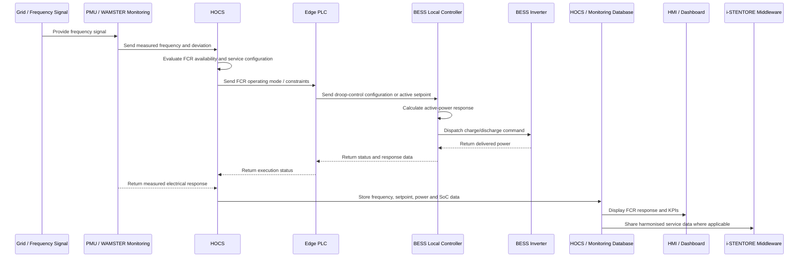

# Implementation Details of FCR in Demo 5

## Demo Context

Demo 5 corresponds to the final i-STENTORE demonstrator **Green Steel Production Facility with energy storage capabilities based on Hydrogen and BESS Technologies – Sweden**.

The final Demo 5 configuration is located at the OVAKO industrial site in Hofors. The demonstrator integrates a Li-ion Battery Energy Storage System with an industrial green-steel production environment involving hydrogen production, furnace operation and heat recovery. Within this environment, the BESS is the main controllable asset for fast electrical flexibility.

In the final Service Repository scope, Demo 5 provides only:

- Energy Arbitrage;
- Frequency Containment Reserve.

---

## Service Objective

The objective of the FCR service in Demo 5 is to demonstrate the technical capability of the industrial BESS to provide fast active-power response to grid-frequency deviations.

The service aims to:

- use the BESS as a fast frequency-response resource;
- provide automatic active-power response according to frequency deviation;
- validate BESS response speed and controllability;
- preserve the required state-of-charge and power margins for frequency response;
- integrate FCR logic with the HOCS and local control environment;
- monitor frequency, setpoints, power response and BESS availability;
- demonstrate FCR / FCR-D technical readiness in an industrial green-steel context;
- retain FCR as the final Demo 5 balancing-service repository entry.

---

## Service Classification

| Field | Description |
|---|---|
| Service name | Frequency Containment Reserve |
| Acronym | FCR |
| Demonstrator | Demo 5 – Sweden |
| Demonstrator title | Green Steel Production Facility with Hydrogen and BESS Technologies |
| Site | OVAKO industrial site, Hofors |
| Service family | Ancillary service / frequency regulation service |
| Main objective | Fast active-power response to frequency deviations |
| Main flexibility asset | Li-ion BESS |
| Associated industrial environment | Hydrogen production, industrial furnace operation and heat recovery |
| Main control layer | HOCS, Edge PLC and local BESS controller |
| Communication layer | MQTT and Modbus TCP, where applicable |
| Monitoring layer | PMU / WAMSTER and site data acquisition |
| Final repository status | Active final Demo 5 service |
| Excluded final Demo 5 frequency services | aFRR and mFRR |

---

## Demonstrator Assets

### Main Electrical Asset

- Li-ion Battery Energy Storage System;
- BESS inverter / power conversion system;
- BESS local controller;
- grid connection point;
- site electrical monitoring infrastructure.

### Industrial Context

- Electrolyser for hydrogen production;
- hydrogen storage and hydrogen supply system;
- industrial furnace / green-steel process;
- district heating or heat-recovery interface;
- industrial electricity demand.

The hydrogen and heat-recovery assets define the industrial context of Demo 5, but the FCR service itself is provided by the BESS.

### Digital and Control Assets

- HOCS;
- HOCS database;
- Edge PLC;
- BESS local controller;
- frequency measurement device;
- PMU / WAMSTER monitoring;
- MQTT communication layer;
- Modbus TCP communication layer;
- HMI or dashboard layer;
- i-STENTORE semantic and service data model layer.

---

## Actors

| Actor | Role |
|---|---|
| Plant Operator | Supervises the industrial site and validates operational constraints. |
| BESS Operator / Controller | Provides the fast active-power response required for FCR. |
| HOCS | Coordinates service configuration, scheduling constraints, monitoring and data exchange. |
| Edge PLC | Executes local control logic and interfaces with field equipment. |
| Frequency Measurement System | Measures grid frequency and provides the activation signal. |
| PMU / WAMSTER Monitoring System | Provides high-resolution monitoring of electrical quantities. |
| TSO / Reserve Market Actor | Represents the external beneficiary or certification context for FCR, where applicable. |
| HMI / Dashboard | Displays frequency, BESS response, state of charge and service KPIs. |
| i-STENTORE Middleware | Supports harmonised service representation and repository-compatible data exchange. |

---

## Operational Principle

The FCR service is based on automatic response to frequency deviations.

The BESS measures or receives the grid-frequency signal and applies a droop-based response logic. The response is proportional to the deviation between the measured frequency and the nominal frequency.

The operating principle is:

1. If the frequency falls below nominal, the BESS discharges and injects active power.
2. If the frequency rises above nominal, the BESS charges and absorbs active power.
3. If the frequency remains inside the deadband, no FCR activation is required.
4. The BESS response must remain within power and state-of-charge limits.
5. The response is monitored and logged for performance assessment.

---

## Relation with Energy Arbitrage

Demo 5 combines FCR with Energy Arbitrage.

Energy Arbitrage defines scheduled BESS operation based on electricity price, forecasted demand and industrial process requirements. FCR requires that part of the BESS power and energy capacity remains available for fast frequency response.

The interaction between the two services requires prioritisation rules.

| Aspect | Energy Arbitrage | FCR |
|---|---|---|
| Main objective | Reduce electricity cost and optimise market-oriented operation. | Provide fast frequency response. |
| Time scale | Day-ahead to intra-day scheduling. | Seconds to minutes. |
| Control type | Optimisation-based scheduling. | Automatic droop-based response. |
| Main BESS requirement | Available energy for charge/discharge scheduling. | Reserved power and SoC margin. |
| Priority during activation | Lower priority during FCR activation. | Higher priority when frequency deviation occurs. |

The Energy Arbitrage schedule should preserve enough BESS headroom for FCR provision during the committed service window.

---

## Timing Requirements

| Parameter | Value / Description |
|---|---|
| Activation trigger | Frequency deviation from nominal frequency |
| Response type | Automatic active-power response |
| Control logic | Droop-based response |
| Response time | Fast response; Demo 5 validation targets sub-second to few-second reaction capability |
| Main unit of service | kW / MW and kWh / MWh |
| Main asset constraint | BESS state of charge and available power |
| Main validation focus | Technical readiness and response performance |
| Final Demo 5 status | Active repository service |

---

## Information and Data Flows

### 1. Frequency Measurement

The frequency measurement or PMU monitoring layer provides:

- measured grid frequency;
- frequency deviation;
- timestamped measurement data;
- activation direction.

### 2. FCR Activation Logic

The BESS controller or local control layer evaluates:

- nominal frequency;
- measured frequency;
- deadband;
- droop setting;
- maximum available response;
- BESS state of charge;
- BESS operational status.

The output of this step is the required FCR active-power setpoint.

### 3. Control Execution

The Edge PLC and BESS local controller execute the setpoint.

The control chain includes:

- setpoint calculation;
- validation against BESS limits;
- dispatch to the inverter or BESS controller;
- measurement of delivered active power;
- status feedback.

### 4. Monitoring

The monitoring system records:

- measured frequency;
- requested power setpoint;
- delivered active power;
- response time;
- state of charge;
- activation duration;
- service availability;
- warnings and alarms.

### 5. Data Storage and Reporting

The HOCS and database layer store:

- frequency event data;
- activation logs;
- BESS setpoints;
- measured response;
- SoC trajectory;
- service KPIs;
- readiness and compliance indicators.

---

## Implementation Workflow

```text
1. Measure grid frequency.
   |
   |-- Nominal frequency
   |-- Measured frequency
   |-- Frequency deviation
   |
2. Evaluate FCR activation condition.
   |
   |-- Apply deadband
   |-- Determine activation direction
   |-- Calculate droop-based response
   |
3. Check BESS availability.
   |
   |-- State of charge
   |-- Available charge/discharge power
   |-- Operational status
   |-- Reserved FCR capacity
   |
4. Dispatch BESS response.
   |
   |-- Frequency below nominal: discharge / inject power
   |-- Frequency above nominal: charge / absorb power
   |
5. Monitor delivery.
   |
   |-- Requested setpoint
   |-- Delivered active power
   |-- Response time
   |-- SoC trajectory
   |
6. Store activation data.
   |
   |-- HOCS database
   |-- Monitoring database
   |-- Service KPI layer
   |
7. Report service performance.
```

---

## Sequence Diagram



---

## Data Inputs

### Frequency and Activation Inputs

| Input | Description | Unit |
|---|---|---|
| nominal_frequency | Nominal grid frequency. | Hz |
| measured_frequency | Real-time measured grid frequency. | Hz |
| frequency_deviation | Difference between measured and nominal frequency. | Hz or mHz |
| activation_deadband | Deadband around nominal frequency. | Hz or mHz |
| droop_setting | Droop or proportional response parameter. | % or MW/Hz |
| activation_direction | Upward or downward response. | n/a |
| response_time_requirement | Expected response-time requirement. | s |

### BESS Inputs

| Input | Description | Unit |
|---|---|---|
| bess_state_of_charge | Current BESS state of charge. | % |
| bess_power_rating | Rated BESS active power. | kW / MW |
| bess_energy_capacity | Rated BESS energy capacity. | kWh / MWh |
| bess_available_charge_power | Available charging power. | kW / MW |
| bess_available_discharge_power | Available discharging power. | kW / MW |
| reserved_fcr_capacity | BESS capacity reserved for FCR. | kW / MW |
| minimum_soc | Minimum operational state of charge. | % |
| maximum_soc | Maximum operational state of charge. | % |
| bess_operational_status | Availability and operating condition of the BESS. | status |

### Control and Monitoring Inputs

| Input | Description | Unit |
|---|---|---|
| fcr_operating_mode | Operating mode enabling FCR / FCR-D logic. | status |
| edge_plc_status | Status of the Edge PLC. | status |
| communication_status | Status of MQTT / Modbus communication. | status |
| pmu_status | PMU or WAMSTER monitoring status. | status |
| alarm_status | BESS or control-chain warning status. | status |

---

## Service Outputs

| Output | Description | Unit |
|---|---|---|
| fcr_power_setpoint | Active-power setpoint calculated for FCR response. | kW / MW |
| delivered_fcr_power | Measured active power delivered by the BESS. | kW / MW |
| fcr_energy_activated | Energy delivered or absorbed during the activation. | kWh / MWh |
| soc_trajectory | State-of-charge evolution during the service. | % |
| response_time | Time between activation condition and BESS response. | s |
| activation_duration | Duration of the FCR activation. | s / min |
| activation_status | Idle, active, completed or unavailable. | status |
| service_availability_status | Whether BESS is available for FCR. | Boolean / status |
| compliance_indicator | Indicator of service response compliance. | n/a |

---

## Optimisation and Control Logic

FCR in Demo 5 is primarily a control service rather than a day-ahead optimisation service. The optimisation challenge is mainly related to reserving sufficient BESS power and SoC margins while Energy Arbitrage uses the same asset.

The control response can be represented as follows.

```text
If frequency < nominal frequency - deadband:
    BESS discharges according to droop curve
    Active power is injected into the grid

If frequency > nominal frequency + deadband:
    BESS charges according to droop curve
    Active power is absorbed from the grid

If frequency is within deadband:
    No FCR activation is required
```

Subject to:

```text
BESS constraints:
    SoC_min <= SoC_t <= SoC_max
    P_discharge_t <= P_discharge_available
    P_charge_t <= P_charge_available
    Reserved FCR capacity is preserved
    BESS operational status is healthy

Control constraints:
    Response follows droop setting
    Response is delivered within the required time
    Communication chain is available
    Local safety limits are respected

Service-stacking constraints:
    Energy Arbitrage schedule must preserve FCR headroom
    FCR response has priority during activation
    SoC recovery strategy must be applied after activation where required
```

---

## Suggested JSON Structure

```json
{
  "service": "FCR",
  "demo": "Demo5",
  "metadata": {
    "service_id": "demo5_fcr",
    "requester_id": "hocs_or_fcr_controller",
    "timestamp": "YYYY-MM-DDTHH:mm:ssZ"
  },
  "frequency": {
    "nominal_frequency": {
      "value": 50.0,
      "unit": "Hz"
    },
    "measured_frequency": {
      "value": null,
      "unit": "Hz"
    },
    "frequency_deviation": {
      "value": null,
      "unit": "Hz"
    },
    "activation_deadband": {
      "value": null,
      "unit": "Hz"
    },
    "droop_setting": {
      "value": null,
      "unit": "%"
    },
    "activation_direction": "upward_or_downward"
  },
  "bess": {
    "state_of_charge": {
      "value": null,
      "unit": "%"
    },
    "power_rating": {
      "value": null,
      "unit": "kW"
    },
    "energy_capacity": {
      "value": null,
      "unit": "kWh"
    },
    "available_charge_power": {
      "value": null,
      "unit": "kW"
    },
    "available_discharge_power": {
      "value": null,
      "unit": "kW"
    },
    "reserved_fcr_capacity": {
      "value": null,
      "unit": "kW"
    },
    "minimum_soc": {
      "value": null,
      "unit": "%"
    },
    "maximum_soc": {
      "value": null,
      "unit": "%"
    },
    "operational_status": "available"
  },
  "control": {
    "fcr_operating_mode": "enabled",
    "edge_plc_status": "available",
    "communication_status": "available",
    "pmu_status": "available",
    "alarm_status": "none"
  },
  "outputs": {
    "fcr_power_setpoint": [],
    "delivered_fcr_power": [],
    "fcr_energy_activated": {
      "value": null,
      "unit": "kWh"
    },
    "soc_trajectory": [],
    "response_time": {
      "value": null,
      "unit": "s"
    },
    "activation_duration": {
      "value": null,
      "unit": "s"
    },
    "activation_status": "idle"
  },
  "kpis": {
    "response_time": null,
    "activation_accuracy": null,
    "availability_ratio": null,
    "delivered_energy": null,
    "compliance_indicator": null
  }
}
```

---

## HMI and Dashboard Requirements

The Demo 5 FCR dashboard should display:

- measured frequency;
- nominal frequency and frequency deviation;
- activation direction;
- droop setting;
- BESS state of charge;
- BESS available charge and discharge power;
- reserved FCR capacity;
- FCR operating mode;
- calculated active-power setpoint;
- delivered BESS power;
- response time;
- activation duration;
- activation accuracy;
- SoC trajectory;
- communication status;
- Edge PLC status;
- PMU / WAMSTER status;
- service availability status;
- historical FCR activation events.

Historical views should include:

- frequency-event records;
- activation timelines;
- requested versus delivered power;
- response-time statistics;
- BESS SoC evolution;
- alarms or availability restrictions;
- service-compliance indicators.

---

## Implementation Status

The FCR service in Demo 5 is retained as an active final repository service.

The implementation includes:

- BESS-based FCR / FCR-D response logic;
- frequency measurement and monitoring;
- droop-based control principle;
- local control-chain representation;
- HOCS / Edge PLC / BESS-controller interaction;
- PMU / WAMSTER monitoring integration;
- harmonised data model;
- repository-compatible JSON structure.

The final readiness should be interpreted as technical readiness / pre-validation for FCR-D, rather than full commercial FCR market participation.

| Criterion | Status |
|---|---|
| Conceptual service definition | Completed |
| Demo-specific workflow | Completed |
| Sequence diagram | Completed |
| Data model orientation | Completed |
| BESS active-power response logic | Completed |
| HOCS / local control interaction | Defined |
| PMU / WAMSTER monitoring | Included |
| Final Demo 5 active service | Yes |
| Excluded final Demo 5 frequency services | aFRR and mFRR |
| Final readiness level | Technical readiness / pre-validation |

---

## Lessons Learned

The Demo 5 FCR implementation provides several lessons:

- industrial BESS assets can provide the fast active-power response required for frequency-containment services;
- FCR provision requires strict control of BESS availability, SoC and power margins;
- Energy Arbitrage schedules must preserve the reserve capacity needed for FCR;
- droop-based response is appropriate for automatic frequency-containment logic;
- high-resolution monitoring is necessary to validate response time and delivered power;
- local communication and control-chain reliability are critical for FCR readiness;

---
