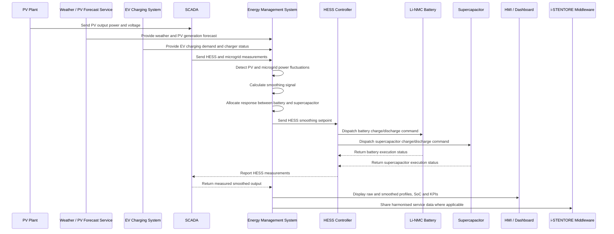

# Implementation Details of Power Smoothing in Demo 4

## Demo Context

Demo 4 corresponds to the i-STENTORE demonstrator **Cooperative Modular Multi Hybrid Energy Storage Systems based on Hybrid SuperCap / Li-NMC batteries for Smart DC Microgrids of E-mobility Service – Italy**.

The demonstrator is based on a Hybrid Energy Storage System (HESS) combining high-energy and high-power storage technologies, connected to a smart DC microgrid and e-mobility infrastructure. The system is designed to coordinate PV generation, EV charging demand, local microgrid operation and hybrid storage control through an Energy Management System.

In this context, Power Smoothing is a renewable-support service that uses the HESS to reduce fluctuations in PV output power and voltage. The service aims to smooth the electricity supplied to the grid and to the local technologies connected in Demo 4, thereby reducing the impact of solar irradiance variability, local demand variations and EV charging dynamics.

---

## Service Objective

The objective of the Power Smoothing service in Demo 4 is to use the HESS to reduce the short-term fluctuations of PV generation and local DC microgrid power flows.

The service aims to:

- smooth PV output power variations caused by solar irradiance fluctuations;
- reduce voltage variations at the PV or microgrid connection point;
- improve local power quality;
- reduce stress on grid-connected equipment;
- coordinate the complementary behaviour of Li-NMC batteries and supercapacitors;
- support EV charging operation without increasing local power-flow variability;
- provide a reusable power-smoothing model for smart DC microgrids and e-mobility hubs.

---

## Service Classification

| Field | Description |
|---|---|
| Service name | Power Smoothing |
| Demonstrator | Demo 4 – Italy |
| Demonstrator title | Cooperative Modular Multi HESS for Smart DC Microgrids of E-mobility Service |
| Service family | Renewable support / power quality / grid-support flexibility |
| Main objective | Smoothing of PV power and voltage fluctuations |
| Main storage asset | Hybrid SuperCap / Li-NMC HESS |
| Main renewable source | PV plant |
| Main local system | Smart DC microgrid and EV charging infrastructure |
| Main control layer | EMS and HESS controller |
| Final implementation level | Modelled / simulation-based validation |
| Main limitation | Full DC microgrid and e-mobility orchestration chain not fully commissioned for end-to-end field validation |

---

## Demonstrator Assets

### Main Assets

- PV plant;
- Hybrid Energy Storage System;
- Li-NMC battery module;
- Supercapacitor module;
- EV charging infrastructure;
- Smart DC microgrid;
- Grid point of delivery;
- Local loads and Renewable Energy Community users, where applicable.

### Digital and Control Assets

- Energy Management System;
- i-STENTORE Service Platform;
- HESS controller;
- Battery controller;
- Supercapacitor controller;
- EV charging management interface;
- OCPP-based charging-control layer;
- Weather forecasting service;
- PV generation forecasting service;
- SCADA system;
- HMI / dashboard;
- i-STENTORE semantic and service data model layer.

---

## Actors

| Actor | Role |
|---|---|
| Energy Management System | Coordinates forecasts, HESS state, PV generation and smoothing optimisation. |
| HESS Controller | Executes the HESS power setpoint and allocates response between storage components. |
| Li-NMC Battery | Provides medium-duration energy support for smoothing. |
| Supercapacitor | Provides fast, high-power support for short-duration fluctuations. |
| PV Plant | Provides renewable generation subject to irradiance-related variability. |
| EV Charging System | Represents local demand that may interact with the smoothing service. |
| SCADA System | Provides real-time measurements from the microgrid, HESS, PV and EV charging infrastructure. |
| Weather Forecasting Service | Provides information supporting PV generation prediction. |
| HMI / Dashboard | Displays PV output, smoothed output, HESS operation and KPIs. |
| i-STENTORE Middleware | Supports harmonised data exchange and service representation. |

---

## Operational Principle

The Power Smoothing service compares the raw PV power output with a target smoothed profile. When the PV output changes rapidly, the HESS compensates for the fluctuation by charging or discharging.

The service operates according to the following logic:

1. When PV generation suddenly increases, the HESS charges to absorb part of the surplus power.
2. When PV generation suddenly decreases, the HESS discharges to compensate for the reduction.
3. Short and fast variations are preferentially assigned to the supercapacitor.
4. Longer or energy-intensive variations are assigned to the Li-NMC battery.
5. The EMS ensures that the HESS state of charge remains within acceptable limits.
6. The resulting smoothed profile is delivered to the DC microgrid or grid connection point.

---

## HESS-Specific Logic

Demo 4 is particularly relevant for Power Smoothing because the HESS combines two storage technologies with complementary characteristics.

### Li-NMC Battery Role

The Li-NMC battery provides:

- energy capacity for sustained compensation;
- medium-duration charge and discharge capability;
- support when PV output remains above or below the target profile for longer periods;
- energy balancing in coordination with EV charging demand.

### Supercapacitor Role

The supercapacitor provides:

- very fast response;
- high-power support for short-duration PV fluctuations;
- protection of the battery against unnecessary high-frequency cycling;
- smoothing of rapid transients caused by solar irradiance changes or EV charging events.

### Coordinated HESS Control

The EMS should allocate the smoothing signal between the battery and supercapacitor according to:

- fluctuation duration;
- power magnitude;
- current state of charge;
- storage availability;
- expected EV charging demand;
- degradation or cycling considerations.

---

## Timing Requirements

| Parameter | Value / Description |
|---|---|
| Planning horizon | Real-time to intra-day |
| Response time | Fast response; suitable for short-term PV fluctuations |
| Duration | Seconds to minutes for supercapacitor support; minutes to hours for battery support |
| Main unit of service | kW / MW and V |
| Main activation trigger | PV output fluctuation or local microgrid power-flow variation |
| Main operational constraint | HESS SoC and storage component availability |
| Final validation status | Modelled / simulation-based validation |

---

## Information and Data Flows

### 1. Measurement and Forecast Acquisition

The EMS collects:

- PV output power;
- PV output voltage;
- weather forecast;
- PV generation forecast;
- local DC microgrid power flow;
- EV charging demand;
- HESS state of charge;
- battery and supercapacitor status;
- grid import/export power.

### 2. Fluctuation Detection

The EMS evaluates the PV output and local microgrid power flow.

The system detects:

- rapid PV power increases;
- rapid PV power decreases;
- voltage variations;
- deviations from the target smoothed profile;
- interaction with EV charging demand.

### 3. Smoothing Signal Calculation

The EMS calculates the compensation power needed to smooth the output profile.

The smoothing signal may be defined as:

- the difference between measured PV output and filtered PV output;
- the difference between measured power flow and target power flow;
- the compensation required to maintain voltage variation within acceptable limits.

### 4. Storage Allocation

The EMS allocates the smoothing signal between:

- supercapacitor, for fast and short-duration fluctuations;
- Li-NMC battery, for longer-duration compensation.

The allocation must respect:

- battery SoC;
- supercapacitor SoC;
- HESS power limits;
- charge/discharge limits;
- EV charging demand;
- local microgrid constraints.

### 5. Dispatch

The EMS sends setpoints to the HESS controller.

The HESS controller dispatches:

- battery charge/discharge commands;
- supercapacitor charge/discharge commands.

### 6. Monitoring and Reporting

The system monitors and stores:

- raw PV output;
- smoothed power profile;
- HESS setpoints;
- battery contribution;
- supercapacitor contribution;
- voltage variation;
- smoothing performance indicators;
- schedule or control deviations.

---

## Implementation Workflow

```text
1. Collect PV, HESS and microgrid data.
   |
   |-- PV output power
   |-- PV output voltage
   |-- Weather forecast
   |-- PV generation forecast
   |-- EV charging demand
   |-- HESS SoC and availability
   |-- Battery SoC
   |-- Supercapacitor SoC
   |
2. Detect PV or microgrid power fluctuations.
   |
   |-- Compare raw PV output with target smoothed profile
   |-- Detect rapid ramps
   |-- Identify voltage variations
   |
3. Calculate smoothing signal.
   |
   |-- Required charge power
   |-- Required discharge power
   |-- Required voltage or power-flow compensation
   |
4. Allocate smoothing response.
   |
   |-- Fast variations to supercapacitor
   |-- Longer variations to Li-NMC battery
   |-- Respect SoC and power limits
   |
5. Dispatch setpoints to HESS controller.
   |
   |-- Battery setpoint
   |-- Supercapacitor setpoint
   |
6. Monitor response.
   |
   |-- Compare raw and smoothed PV output
   |-- Monitor HESS operation
   |-- Monitor EV charging interaction
   |
7. Store results and calculate KPIs.
```

---

## Sequence Diagram



---

## Data Inputs

### Renewable and Microgrid Inputs

| Input | Description | Unit |
|---|---|---|
| pv_output_power | Measured PV active power. | kW / MW |
| pv_output_voltage | PV or point-of-connection voltage. | V |
| pv_generation_forecast | Forecasted PV generation. | kW / MW |
| weather_forecast | Weather information supporting PV forecast. | n/a |
| microgrid_power_flow | Power flow in the DC microgrid. | kW / MW |
| grid_import_export_power | Power exchanged with the grid. | kW / MW |
| ev_charging_demand | Current or forecasted EV charging demand. | kW / MW |

### HESS Inputs

| Input | Description | Unit |
|---|---|---|
| hess_state_of_charge | Aggregated HESS state of charge or equivalent state indicator. | % |
| hess_availability | Availability status of the HESS. | Boolean / status |
| hess_power_limit | Maximum HESS charge/discharge power. | kW / MW |
| battery_state_of_charge | Li-NMC battery state of charge. | % |
| battery_power_limit | Li-NMC battery charge/discharge limit. | kW / MW |
| supercapacitor_state_of_charge | Supercapacitor state of charge. | % |
| supercapacitor_power_limit | Supercapacitor charge/discharge limit. | kW / MW |
| charger_status | Operational status of EV charging infrastructure. | status |

---

## Service Outputs

| Output | Description | Unit |
|---|---|
| smoothing_signal | Required compensation power for smoothing. | kW / MW |
| hess_smoothing_setpoint | Aggregated HESS power setpoint. | kW / MW |
| battery_setpoint | Li-NMC battery charge/discharge setpoint. | kW / MW |
| supercapacitor_setpoint | Supercapacitor charge/discharge setpoint. | kW / MW |
| smoothed_power_output | Resulting smoothed PV or microgrid power output. | kW / MW |
| voltage_smoothing_indicator | Indicator of voltage variation reduction. | V or % |
| power_fluctuation_reduction | Reduction of active-power fluctuations. | % |
| storage_utilisation | HESS utilisation during the service. | % |
| service_status | Activation or validation status. | status |

---

## Optimisation Logic

The Power Smoothing optimisation can be represented as a hybrid-storage allocation problem.

```text
Minimise:
    Deviation between measured power output and target smoothed profile
    + voltage fluctuation indicator
    + battery cycling penalty
    + HESS operational penalties
```

Subject to:

```text
HESS constraints:
    SoC_min <= SoC_hess_t <= SoC_max
    P_charge_t <= P_charge_max
    P_discharge_t <= P_discharge_max
    HESS availability is respected

Battery constraints:
    Battery SoC and power limits are respected
    Battery is prioritised for longer-duration energy balancing
    Excessive high-frequency battery cycling is avoided

Supercapacitor constraints:
    Supercapacitor SoC and power limits are respected
    Supercapacitor is prioritised for fast and short-duration fluctuations

PV and microgrid constraints:
    PV output fluctuations are compensated where feasible
    Microgrid power-flow and voltage limits are considered
    EV charging demand is considered in the local power balance
```

---

## Suggested JSON Structure

```json
{
  "service": "PowerSmoothing",
  "demo": "Demo4",
  "metadata": {
    "service_id": "demo4_power_smoothing",
    "requester_id": "ems_or_service_platform",
    "timestamp": "YYYY-MM-DDTHH:mm:ssZ"
  },
  "renewableGeneration": {
    "pv_output_power": {
      "value": null,
      "unit": "kW"
    },
    "pv_output_voltage": {
      "value": null,
      "unit": "V"
    },
    "pv_generation_forecast": [],
    "weather_forecast": []
  },
  "microgrid": {
    "microgrid_power_flow": {
      "value": null,
      "unit": "kW"
    },
    "grid_import_export_power": {
      "value": null,
      "unit": "kW"
    },
    "ev_charging_demand": {
      "value": null,
      "unit": "kW"
    }
  },
  "hess": {
    "state_of_charge": {
      "value": null,
      "unit": "%"
    },
    "availability": true,
    "power_limit": {
      "value": null,
      "unit": "kW"
    },
    "battery": {
      "technology": "Li-NMC",
      "state_of_charge": {
        "value": null,
        "unit": "%"
      },
      "power_limit": {
        "value": null,
        "unit": "kW"
      }
    },
    "supercapacitor": {
      "state_of_charge": {
        "value": null,
        "unit": "%"
      },
      "power_limit": {
        "value": null,
        "unit": "kW"
      }
    }
  },
  "outputs": {
    "smoothing_signal": [],
    "hess_smoothing_setpoint": [],
    "battery_setpoint": [],
    "supercapacitor_setpoint": [],
    "smoothed_power_output": []
  },
  "kpis": {
    "power_fluctuation_reduction": null,
    "voltage_fluctuation_reduction": null,
    "smoothing_error": null,
    "storage_utilisation": null,
    "battery_cycling_reduction": null
  }
}
```

---

## HMI and Dashboard Requirements

The Demo 4 Power Smoothing dashboard should display:

- raw PV output power;
- smoothed PV or microgrid power output;
- PV output voltage;
- voltage fluctuation indicator;
- HESS state of charge;
- Li-NMC battery SoC;
- supercapacitor SoC;
- HESS smoothing setpoint;
- battery and supercapacitor contributions;
- EV charging demand;
- power fluctuation reduction;
- storage utilisation;
- warnings related to SoC limits or HESS unavailability.

Historical views should include:

- raw versus smoothed PV output;
- voltage variation before and after smoothing;
- HESS response during smoothing events;
- battery and supercapacitor utilisation;
- EV charging interaction;
- smoothing performance indicators over time.

---

## Implementation Status

The Power Smoothing service in Demo 4 was fully defined as part of the HESS-based smart DC microgrid service portfolio.

The implementation includes:

- service objective and workflow definition;
- HESS-based smoothing logic;
- actor and information-flow model;
- sequence diagram;
- data model orientation;
- simulation-based validation logic.

The complete end-to-end field validation was limited by the commissioning status of the full DC microgrid and e-mobility orchestration chain. Therefore, the service is represented in the repository as a **modelled / simulation-based validation** service, ready for future field deployment once the complete operational infrastructure is available.

| Criterion | Status |
|---|---|
| Conceptual service definition | Completed |
| Service workflow | Completed |
| Sequence diagram | Completed |
| Data model orientation | Completed |
| HESS control logic | Completed|
| Battery / supercapacitor allocation logic | Completed|
| Full DC microgrid commissioning |

---

## Lessons Learned

The Demo 4 Power Smoothing implementation provides several lessons:

- hybrid storage is particularly suitable for smoothing PV fluctuations;
- supercapacitors can reduce the exposure of batteries to high-frequency cycling;
- Li-NMC batteries are better suited for sustained smoothing over longer periods;
- EV charging demand must be included in the smoothing logic because it affects local power-flow dynamics;
- PV and weather forecasts improve the anticipation of smoothing needs;
- the service depends on reliable SCADA and EMS integration;
- the same HESS architecture can support both Power Smoothing and Congestion Management if appropriate prioritisation rules are defined.

---
